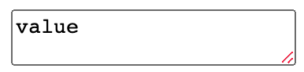
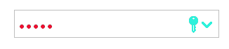

# CSS 'accent-color' Proposal

Mason Freed</p>
September 11, 2020</p>

<br>

As discussed on [CSSWG Issue 5187](https://github.com/w3c/csswg-drafts/issues/5187), and at the [July 1, 2020](https://github.com/w3c/csswg-drafts/issues/5187#issuecomment-652700033), [July 22, 2020](https://github.com/w3c/csswg-drafts/issues/5187#issuecomment-662570409), [August 19, 2020](https://github.com/w3c/csswg-drafts/issues/5187#issuecomment-676546952), and [August 26, 2020](https://github.com/w3c/csswg-drafts/issues/5187#issuecomment-680996476) CSSWG meetings,
there is a desire to expand the stylability of form control elements,
in particular by allowing the specification of the “accent color” for various elements.

This proposal is a result of those discussions.


# Proposed Spec Text

<pre>
<b>Name</b>: ‘accent-color’
<b>Value</b>: &lt;color>+
<b>Initial</b>: 'auto'
<b>Applies to</b>: form control elements
<b>Inherited</b>: yes
<b>Percentages</b>: N/A
<b>Computed value</b>: computed color, see resolving color values
<b>Canonical order</b>: per grammar
<b>Animation type</b>: by computed value type

The 'accent-color' CSS property sets the color of
the “accent” parts or pieces of form control elements.
The first provided &lt;color> value is to be used
for “primary” accent elements.
If a second &lt;color> value is provided,
that color should be used for “contrasting” accent elements.
The third and subsequent colors are only used
on some form control elements in some cases,
for additional “accent” parts other than “primary” or “contrasting”.

If any color is not provided,
or if <dfn for=accent-color value>auto</dfn> is provided for any color value,
then the UA should attempt to select an appropriate color
that offers good contrast and visibility
when paired with remaining provided colors, if any.
In selecting ''accent-color/auto'' colors,
if the operating system provides an “Accent Color” or similar user setting,
the UA is encouraged to respect that setting as much as possible.
The UA may use a similar, though not identical, color in some cases,
for example to enhance contrast or accessibility.

In limited circumstances,
it is permissible for user agents to render the accent parts of some controls
using different colors than those specified by 'accent-color',
for example to maintain design guidelines or accessibility constraints.
In those cases, the rendered color should be influenced as much as possible
by the specified 'accent-color'.
For example, the UA may wish to
only render the checkbox glyph in either white or black;
in this case, the selection of white or black should depend
on the 'accent-color' value,
e.g. using the luminosity of the provided color.

Not all form elements contain “accent” parts,
and not all user agents use the same “accent” parts
in exactly the same way for the same form control.
However, the intention is that
if the same or similar accent parts exist on a given form element,
it should be associated with the “primary” or “contrasting” colors
in the same way across user agents.
This is important to ensure good interop of the 'accent-color' property.
For that reason, there is a table of form elements provided below,
which serves as guidance on the various accent parts for each control.
While the table is not normative,
it is intended to provide some alignment and uniformity of implementation
across user agents.

The text content of form control elements
is explicitly <em>not</em> included in the set of “accent” parts,
as text content is already controlled by the 'color' property.
In addition, the 'background-color' property is often used
to control the rendering for some background parts of form controls--
those parts are similarly not included in the set of “accent” parts
that are subject to control via the 'accent-color' property.
</pre>


# Motivation and Intent

This section is non-normative.

In implementing `accent-color`, there are two competing/conflicting goals:
1. **Encourage interoperability** among browsers.
It is important that developers be able to expect similar, if not the same,
behavior across browsers.
2. **Encourage** (and do not constrain) browser vendors' **innovation**
of form control elements.

The goal of interoperability pushes this solution
towards a more strict specification of exactly how
to use each `accent-color` value on each form control element.
However, the goal of allowing innovation pushes this solution
**away** from strict specifications for how each form control looks or acts.
This specification attempts to provide a good middle ground,
which maximizes interoperability while minimizing constraints to innovation.

The general methodology for achieving the above compromise
is to examine the set of existing form control elements
([as of 2020](#existing-control-examples-as-of-2020)),
and agree on the *basics* of the way `accent-color` is applied
to each of those existing controls.
It is *explicitly* recognized that each browser
provides different implementations of each form control,
with their own look and feel.
This spec does not try to eliminate those differences.
However, it does try to provide some level of uniformity and interoperability,
where commonalities exist.

This will require judgement when applying the recommendations
to new or existing form controls.
The goal would be to adhere to the *spirit* of this spec as much as possible.
For example, if the guidance states
that an `accent-color` value should apply to a particular accent part,
and the browser implementation of that part
uses a gradient fill rather than a single color,
then there may be multiple ways to “use” the `accent-color` value
to affect the gradient rendering of that part.
The goal would be to match the guidance where it makes sense, and when possible.
That might mean replacing the gradient with a solid fill,
or it might mean changing the endpoint values of the gradient
to match the `accent-color` value *in aggregate*.
Or it might mean another behavior entirely.
The point is that the guidance should be consulted and used as input
in determining how to proceed.

Further, this spec is careful to not **require** exact conformance
of each form control with the `accent-color` spec.
It merely encourages browsers to follow the guidance for form controls elements
that are “close enough” to the existing set of controls.
For brand new paradigms, input surfaces, control types, etc.,
this spec does not attempt to limit innovation.
If there are similar **parts** of these new-paradigm controls,
then as much as possible/reasonable, those parts should be guided by this spec.
But this should not be seen as any limitation on innovation.

To assist in characterizing “close enough”
as it relates to the accent parts of form control elements,
the [Existing Control Examples](#existing-control-examples-as-of-2020)
section of this document includes many examples of several control types,
pulled from different browsers, operating systems, and time periods.
Except where noted, each of the control examples within each group
should be considered “close enough” to the group
that the guidance for that group should apply.

# Per-Control Guidance

This section is non-normative.

It describes the potential accent parts for each control,
and whether those parts should be styled
with the “primary”, “contrasting”, or “additional” `accent-color` colors.
If a given form control on a given user agent
has substantially different accent parts,
such that the descriptions below do not apply,
then care should be taken to attempt to align those parts with the described set,
so that developers using `accent-color` will get predictable,
interoperable results as much as possible.
Note also that some of the described accent parts
will not exist on all implementations--
in this situation, those elements can be disregarded in the descriptions below.

## `<input type=checkbox>`

A checkbox is typically composed of a “checkmark” glyph
on top of a shaded background.
The glyph should be considered a “contrasting” accent,
while the shaded background behind the glyph
should utilize the “primary” accent color.


| Sample | CSS |
|---|---|
|  | <pre>accent-color: blue white;</pre> |


## `<input type=radio>`

A radio button is typically composed of a “dot” on top of a shaded background.
The “dot” should be considered a “contrasting” accent,
while the shaded background behind the dot
should utilize the “primary” accent color.


| Sample | CSS |
|---|---|
|  | <pre>accent-color: blue white;</pre> |


## `<select>`

A `<select>` control is typically displayed as
a text area containing the currently-selected `<option>` text,
and an activation “widget” or arrow which is used to pop up the list of options.
The `background-color` CSS property is typically used as the background
behind the currently-selected text display.
The accent part here is the activation widget/button and the background behind it.
The arrow, icon, or other widget
should be considered the “contrasting” accent,
while the shaded background behind the widget/button (if present)
should utilize the “primary” accent color.

| Sample | CSS |
|--------|-----|
|  | <pre>accent-color: lightblue black;<br>background-color: lightgreen;</pre> |


## `<input type=text list=datalist>`

This control is typically called a “combo-box”,
and it includes an ordinary text input plus (sometimes)
an activation widget/button which brings up a list of suggestions,
very similar to a `<select>` control.
The arrow, icon, or other activation widget
should be considered the “contrasting” accent,
while the shaded background behind the widget/button
should utilize the “primary” accent color.

| Sample | CSS |
|--------|-----|
|  | <pre>accent-color: lightblue white;<br>background-color: darkgreen;<br>color: white;</pre> |


## `<select multiple>`

A multi-select is typically composed of
a rectangular area containing several rows of text,
each corresponding to a contained `<option>`.
There are typically no additional widgets or accents provided;
therefore, `accent-color` would typically have no affect on `<select multiple>`.
However, it is possible that a UA might, for example,
add checkboxes next to each option,
to allow the user to select and de-select options more easily.
In that case, the checkbox accents should be styled
using the same rules as described for `<input type=checkbox>` above.


| Sample | CSS |
|--------|-----|
|  | N/A |


## `<button>`

A button does not typically have any specific accent pieces.
And since `<button>` can contain arbitrary, CSS-stylable content,
there will likely be no need to apply `accent-color` to the parts of `<button>`.

| Sample | CSS |
|--------|-----|
|  | N/A |


## `<input type=range>`

A range input has several potential accent parts.
One is the thumb, which is the part of the `<range>`
that the user can drag along the track.
The thumb should be considered to be a “contrasting” accent.
If a `list=datalist` attribute is set on the `<range>`,
then tickmarks are typically also drawn at the option values given in the datalist.
Such tick marks should also be considered “contrasting” accent elements.
The remaining accent element is the track that the thumb slides along,
which is sometimes shaded differently on one side of the thumb vs. the other.
In the case that a **single** color is used on both sides of the thumb,
the track should be considered a “primary” accent.
Sometimes, a separate color is used to shade
the ”filled” portion of the range, between 0 and `range.value`.
In this case, the “filled” portion of the range
should be considered a “primary” accent,
and a third `<color>` value can be used to shade the other side of the range:

```css
accent-color: filled-track-color thumb-and-ticks-color rest-of-track-color
```

Here, the “filled” portion of the track should be colored with `filled-track-color`,
and the "other" side should be filled with `rest-of-track-color`.


| Sample | CSS |
|--------|-----|
|  | <pre>accent-color: blue black lightgrey;</pre> |


## `<progress>`

A progress bar is typically composed of a shaded track,
within which a portion of the track is shaded in a different color
to indicate the value of the control.
The shaded background of the progress bar should be considered a “contrasting” accent,
while the filled “value” portion of the progress bar should be considered “primary”.

| Sample | CSS |
|--------|-----|
|  | <pre>accent-color: blue lightgrey;</pre> |


## `<input type=color>`

A color picker typically only contains
a color swatch displaying the currently-selected color,
and a shaded background.
In most all cases,
the shaded background can be controlled with the `background-color` CSS property.
Since no other controls typically exist,
`accent-color` will not apply.
If, in some implementation, an activation widget/button exists,
then that button should be treated in the same way
as the activation button for `<select>`.


| Sample | CSS |
|--------|-----|
|  | N/A (`color.value` is `red` here)|


## `<input type=color list=datalist>`

A color suggestion control, when provided,
typically contains a color swatch displaying the currently-selected color,
and an activation widget/button that can be used to pop up the suggestions list.
The activation widget/button should be considered a “contrasting” accent element,
while any separately-shaded background behind the widget
should be considered to be a “primary” element.


| Sample | CSS |
|--------|-----|
|  | <pre>accent-color: auto black;</pre> |


## `<input type=file>`

A file picker is typically composed of
a “browse” button and
a separate text area for displaying the selected file(s).
In most cases, the text area portion can be completely controlled
with the `color` and `background-color` CSS properties.
The “browse” button, on the other hand,
is not typically affected by either property.
However, given that accent-color has no affect on a standard `<button>`,
and given that there is a [proposal](https://github.com/w3c/csswg-drafts/issues/5049)
to add an explicit `::file-chooser-button` pseudo-element for the button,
the `'accent-color'` property should have no affect on the file picker button.

| Sample | CSS |
|--------|-----|
|  | N/A |


## `<textarea>`

A text area is composed of a typically-resizable rectangle for text.
In most cases, the lower-right corner (for direction:ltr text)
contains a “drag handle” that can be used to resize the text area.
This drag handle should be considered a “contrasting” accent element.
If the drag handle is drawn with a shaded background (not typical),
then this background should be considered a “primary” accent element.

| Sample | CSS |
|--------|-----|
|  | <pre>accent-color: auto red;</pre> |


## `<input type=date|time|datetime-local|week|month>`

A date/time control is typically composed of
a text field that displays the currently-selected date/time,
and an activation widget/button which is used to bring up a pop-up “picker”.
The activation widget/button should be considered a “contrasting” accent element,
while any separately-shaded background behind the widget
should be considered to be a “primary” element.
Sometimes, the date/time control will contain a “clear” button/widget,
used to clear the value of the control.
Similarly here, the “clear” button/widget
should be considered a “contrasting” element,
and any separately shaded background behind the widget
should be considered a "primary" element.

| Sample | CSS |
|--------|-----|
|  | <pre>accent-color: auto green;</pre> |

## `<input type=text|search|password|email|tel|url|...>`

Text-input controls are typically rendered as an empty box
containing the value of the input as text,
and do not have any parts highlighted by the [=accent color=].
However, sometimes additional controls are embedded,
such as a “clear value” button,
or a “show/hide password” button.
If the visual style uses its [=accent color=] to render any of these,
then they are likewise affected by 'accent-color'.

| Sample | CSS |
|--------|-----|
|  | <pre>color: red;<br>accent-color: auto cyan;</pre> |

