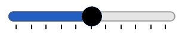

# CSS 'accent-color' Proposal

Drafted by Mason Freed, 11 September 2020<br>
Revised by fantasai, 7 October 2020

<br>

As discussed on [CSSWG Issue 5187](https://github.com/w3c/csswg-drafts/issues/5187), and at the [July 1, 2020](https://github.com/w3c/csswg-drafts/issues/5187#issuecomment-652700033), [July 22, 2020](https://github.com/w3c/csswg-drafts/issues/5187#issuecomment-662570409), [August 19, 2020](https://github.com/w3c/csswg-drafts/issues/5187#issuecomment-676546952), and [August 26, 2020](https://github.com/w3c/csswg-drafts/issues/5187#issuecomment-680996476) CSSWG meetings,
there is a desire to expand the stylability of form control elements,
in particular by allowing the specification of the “accent color” for various elements.

This proposal is a result of those discussions.

# Motivation and Intent

In implementing `accent-color`, there are two competing/conflicting goals:
1. **Encourage interoperability** among browsers.
It is important that developers be able to expect similar, if not the same,
behavior across browsers,
and most critically, to get **usable** results on all browsers and platforms
now and in the future.
2. **Encourage** (and do not constrain) vendors’ **innovation**
of form control elements.

The goal of interoperability pushes this solution
towards a more strict specification of exactly how
to use each `accent-color` value on each form control element.
However, the goal of allowing innovation pushes this solution
**away** from strict specifications for how each form control looks or acts.
This specification attempts to provide a good middle ground,
maximizing necessary interoperability while minimizing constraints to innovation.

The general methodology for achieving the above compromise
is to examine the set of existing form control elements
([as of 2020](#existing-control-examples-as-of-2020)),
and agree on where and how an accent color is considered to have been applied
to each of those existing controls,
and define that those uses of color are replaced by the specified `accent-color`.
It is *explicitly* recognized that each browser
provides different implementations of each form control,
with their own look and feel.
This spec does not try to eliminate those differences.

This will require judgement when applying the recommendations
to new or existing form controls.
The goal is to adhere to the *spirit* of the feature as much as possible.
For example, if the specification requires
that an `accent-color` value should apply to a particular accent part,
and the browser implementation of that part
uses a gradient fill rather than a single color,
then there may be multiple ways to “use” the `accent-color` value
to affect the rendering of that part.
It might mean replacing the gradient with a solid fill,
or it might mean changing the endpoint values of the gradient
to match the `accent-color` value *in aggregate*.
Or it might mean another behavior entirely.
Non-normative examples and guidance are provided
as input to help the UA determine how to interpret `accent-color`
as appropriate to its own platform and implementation.

# Proposed Spec Text

```
<pre class=propdef>
Name: accent-color
Value: auto | <<color>>
Initial: ''auto''
Applies to: all elements
Inherited: yes
Percentages: N/A
Computed value: computed color
Canonical order: per grammar
Animation type: by computed value type
</pre>

User interface controls on any given platform are typically designed as a cohesive set,
under a single, cohesive visual style.
On many platforms (though not all),
the visual style includes the use of an <dfn>accent color</dfn>,
a typically bright color that contrasts markedly
with the more utilitarian background and foreground colors.
Not every control uses the [=accent color=] in every state,
but it is nonetheless a core part of the controls’ color scheme.

The 'accent-color' CSS property allows the author to specify the [=accent color=]
for user-interface controls represented by the element.
An <dfn for=accent-color value>auto</dfn> value represents a UA-chosen color,
which should match the [=accent color=] of the platform, if any.
A <dfn for=accent-color value><<color>></dfn> value
specifies that color as the desired [=accent color=].

The UA should use the 'accent-color'
to draw whichever parts of the form control
would have otherwise been styled with an [=accent color=].
The UA may adjust the luminance or brightness of the color
or make color substitutions in other parts of the control
(e.g. switching an overlaid glyph from using 'color' to using 'background-color'),
as necessary to maintain contrast for legibility of the control,
and may generate variations of the color for gradients etc.
and to match the control to platform conventions for the use of the accent color.

For example ...
```

# Examples

This section is non-normative.

## `<input type=checkbox>`

A checkbox is typically composed of a square,
potentially overlaid by a “checkmark” glyph representing the checked state.

Certain visual styles use an accent color for the checked state:
some of these use it for the background of the circle,
others for its foreground.
In both cases, 'accent-color' would be used to style
the affected parts of the control.
For visual styles that do not use an [=accent color=],
'accent-color' will have no effect.

The following are all examples of checkboxes rendered with a blue 'accent-color':

| Browser   | Platform  | Sample | Notes |
|-----------|-----------| :---:  |-------|
| Firefox 79| Win       |   | No use of accent color |
| Chrome 81 | Win       |   | No use of accent color |
| Chrome 83 | Win/Light |   | Accent color as checked item “background” |
| Chrome 86 | Win/Dark  |   | Accent color as checked item “background” |
| Safari 13 | Mac/Light |   | Accent color as checked item “background” |
| Safari 13 | Mac/Dark  |   | Accent as checked item “background”, and also used to generate highlight and shadow colors around the edges |
| Snow Leopard | Mac    |   | Accent color used to generate checked “background” gradient |

Depending on the specified 'accent-color',
in order to preserve sufficient contrast
between the square and the checkmark
the UA might need to make some adjustments.
For example,
when applying 'accent-color' as the square’s “background”,
the UA could either adjust the accent color’s luminosity or brightness enough
to contrast with the color used to draw the “checkmark”
or change the color used for the “checkmark” to conrast better with the 'accent-color',
for example by switching from using the scheme’s foreground color to its background color
or vice versa.
If using 'accent-color' for the “checkmark” instead,
a different adjustment might be needed
since the relevant contrast would be between the 'accent-color'
and the square’s fill color.

## `<input type=radio>`

A radio button is typically composed of a circle,
potentially overlaid by a “dot” representing the checked state.

As with checkboxes,
certain visual styles use an accent color for the checked state:
some of these use it for the background of the circle,
others for its foreground.
In both cases, 'accent-color' would be used to style
the affected parts of the control.
For visual styles that do not use an [=accent color=],
'accent-color' will have no effect.

The following are all examples of radio buttons rendered with a blue 'accent-color':

| Browser   | Platform  | Sample | Notes
|-----------|-----------| :---:  |-------|
| Firefox 79| Win       |   | No use of accent color |
| Chrome 81 | Win       |   | No use of accent color |
| Chrome 83 | Win/Light |   | Accent color as checked “foreground” |
| Chrome 86 | Win/Dark  |   | Lightness-adjusted accent color as checked “foreground” |
| Safari 13 | Mac/Light |   | Accent color as checked “foreground” |
| Safari 13 | Mac/Dark  |   | Accent color as checked “foreground” |
| Snow Leopard | Mac    |   | Accent color used to generate checked “background” gradient |

Depending on the specified 'accent-color',
in order to preserve sufficient contrast
between the circle and the dot
the UA might need to make some adjustments.
For example,
when applying 'accent-color' as the “background”,
the UA could either adjust the accent color’s luminosity or brightness enough
to contrast with the color used to draw the “dot”
or change the color used for the “dot” to contrast better with the 'accent-color',
for example by switching from using the scheme’s foreground color to its background color
or vice versa.
If using 'accent-color' for the “dot” instead,
a different adjustment might be needed
since the relevant contrast would be between the 'accent-color'
and the circle’s fill color.

## `<select>` / `<input type=text list=datalist>`

Drop-down and combo-box controls are typically displayed as
a text area containing the currently-selected value,
and an activation “widget” (such as an arrow button)
which is used to pop up the list of options.

Some visual styles use an accent color for the activation widget.
In these styles, 'accent-color' would be used to style the widget.

The following are all examples of drop-down controls rendered with a blue 'accent-color':

| Browser   | Platform  | Sample | Notes |
|-----------|-----------| :---:  |-------|
| Firefox 79| Win       |  | No use of accent color |
| Chrome 81 | Win       |  | No use of accent color |
| Chrome 83 | Win/Light |  | No use of accent color |
| Chrome 86 | Win/Dark  |  | No use of accent color |
| Safari 13 | Mac/Light |  | Accent color lightened and used to generate drop-down widget “background” gradient |
| Safari 13 | Mac/Dark  |  | Accent color used to generate drop-down widget “background” gradient |
| Snow Leopard | Mac    |  | Accent color used to generate drop-down widget “background” gradient |

Depending on the specified 'accent-color',
in order to preserve sufficient contrast
within the activation widget
the UA might need to make some adjustments.
For example,
when applying 'accent-color' as a background,
the UA could either adjust the accent color’s luminosity or brightness enough
to contrast with the color used to draw the arrows
or change the color used for the arrows,
for example by switching from using the foreground color to the background color
or vice versa.
If using 'accent-color' for the arrows instead,
a different adjustment might be needed
since the relevant contrast would be between the 'accent-color'
and the widget’s background.

## `<select multiple>`

A multi-select is typically composed of
a rectangular area containing several lines of text,
each corresponding to an option.
Depending on the visual style,
selected options might be identified as highlighted items
or identified by some adjacent icon such as a checkmark.
In visual styles where the highlight is intended to match the [=accent color=],
the UA would use specified 'accent-color'.


## `<button>` / `<input type=submit|reset|button>`

A button does not typically have any [=accent colored=] pieces.


## `<input type=range>`

A range input many parts, and thus many potential accent parts.
One is the thumb, which is the part of the `<range>`
that the user can drag along the track.
Another is the track that the thumb slides along,
which is sometimes shaded differently on the “filled” side of the thumb,
the portion of the range, between 0 and `range.value`.
Whichever portion of the range input is typically colored by the [=accent color=]
would be likewise affected by 'accent-color'.




## `<progress>`

A progress bar is typically composed of a shaded track,
within which a portion of the track is shaded in a different color
to indicate the value of the control.
Whichever portion of the progress bar is typically colored by the [=accent color=]
would be likewise affected by 'accent-color'.


## `<input type=text|search|password|email|tel|url|...>`

Text-input controls are typically rendered as an empty box
containing the value of the input as text,
and do not have any parts highlighted by the [=accent color=].
However, sometimes additional controls are embedded,
such as a “clear value” button,
or a “show/hide password” button.
If the visual style uses its [=accent color=] to render any of these,
then they would be likewise affected by 'accent-color'.


## `<input type=number|date|time|datetime-local|week|month>`

A number of more complex input controls are typically rendered as
a text field that displays the currently-selected value,
and an activation widget/button which is used to bring up a pop-up “picker”.
As with text-input controls,
if the visual style uses its [=accent color=] to render any part of the activation widget,
then they are likewise affected by 'accent-color'.
Additionally, if the visual style uses its [=accent color=] within the pop-up “picker”,
then those affected parts, too, can be affected by 'accent-color'.


